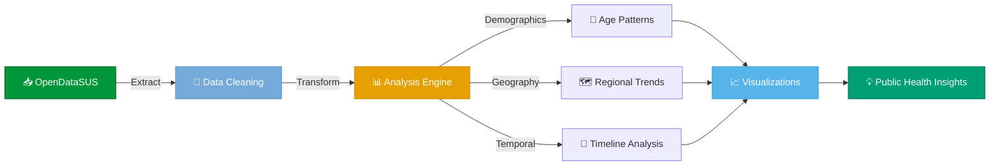
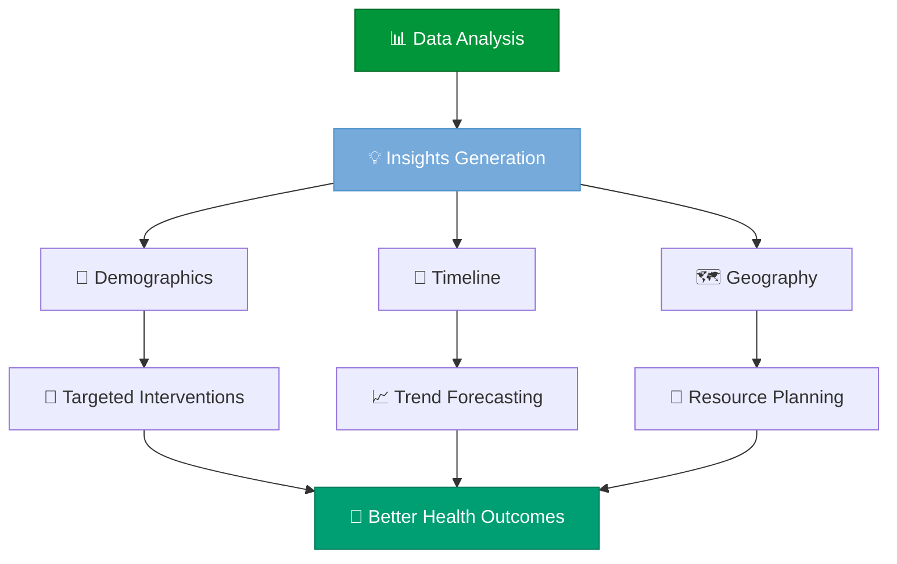

<!-- Hero Section -->
<div align="center">


<br><br>


<br>

**Final Project - Data Analysis Training Program for Health Management**

[🎯 Mission](#-mission) • [📊 Insights](#-key-insights) • [🛠️ Technologies](#️-technologies) • [📈 Findings](#-critical-findings) • [🌍 Impact](#-real-world-applications)

</div>

---


<!-- Project Overview -->
## 💡 **The Story Behind the Numbers**

<table>
<tr>
<td width="60%">

### 🎯 **The Mission**

What began as a **routine data analysis assignment** became a **profound journey into the human cost of a global pandemic.**

This project analyzes **5 years of SARS data** (2020-2024) from Espírito Santo, Brazil, transforming raw epidemiological information into meaningful insights about COVID-19's impact on our community.

> *"When data becomes the lens through which we understand human suffering and resilience, every visualization tells a story of lives touched, families changed, and communities transformed."*

**Key Question:** *How did Espírito Santo navigate one of the most challenging periods in modern history?*

</td>
<td width="40%">


</td>
</tr>
</table>


<!-- The Challenge -->
## 📊 **The Challenge**

<div align="center">

### **Making Sense of Overwhelming Data**

<table>
<tr>
<td align="center" width="25%">

### 📁 **Volume**


Nationwide SARS cases spanning 5 years

</td>
<td align="center" width="25%">

### 🗺️ **Scope**


State-level analysis with municipal depth

</td>
<td align="center" width="25%">

### ⏰ **Timeline**


Complete pandemic evolution tracking

</td>
<td align="center" width="25%">

### 🔬 **Complexity**


Demographics, geography, temporal patterns

</td>
</tr>
</table>

</div>

### 🌊 **The Pandemic Journey**

<table>
<tr>
<td width="50%">

#### **The Data Reality**
- 🦠 **Wave 1 (2020)**: The unknown enemy arrives
- 💉 **Wave 2 (2021)**: Variants and vaccine hope  
- 🏥 **Wave 3 (2022)**: Living with COVID-19
- 📉 **Recovery (2023-2024)**: The new normal emerges

</td>
<td width="50%">

#### **The Solution**
- 📊 **Automated ETL**: From OpenDataSUS to insights
- 🎨 **Visual Storytelling**: Every chart tells a story
- 🔍 **Pattern Recognition**: Hidden trends revealed
- 📝 **Actionable Intelligence**: Data-driven recommendations

</td>
</tr>
</table>


<!-- Key Insights -->
## 🔍 **Key Insights**

<div align="center">

### **Uncovering Patterns in the Pandemic**

</div>

### 📊 **Analysis Framework**



### 🎯 **Three Dimensions of Analysis**

<table>
<tr>
<td width="33%" align="center">

### 👥 **Demographics**

**Who was affected?**

- 👴 Elderly population vulnerability
- 📊 Age group distribution shifts
- 💉 Vaccination impact by age
- 🎯 High-risk profile identification

</td>
<td width="33%" align="center">

### 📅 **Temporal**

**When did waves occur?**

- 🌊 Wave pattern identification
- 📈 Peak periods and recovery
- 🎄 Seasonal variations
- 📉 Long-term trend analysis

</td>
<td width="33%" align="center">

### 🗺️ **Geographic**

**Where was impact greatest?**

- 📍 Municipal distribution
- 🏥 Healthcare system stress
- 🌆 Urban vs rural patterns
- 🎯 Regional intervention needs

</td>
</tr>
</table>


<!-- Technologies -->
## 🛠️ **Technologies**

<div align="center">

### **Epidemiological Analysis Stack**

<table>
<tr>
<td align="center" width="20%">
<br>
<b>R Language</b><br>
<sub>Statistical Computing</sub>
</td>
<td align="center" width="20%">
<br>
<b>Quarto</b><br>
<sub>Scientific Publishing</sub>
</td>
<td align="center" width="20%">
<br>
<b>ggplot2</b><br>
<sub>Data Visualization</sub>
</td>
<td align="center" width="20%">
<br>
<b>dplyr</b><br>
<sub>Data Manipulation</sub>
</td>
<td align="center" width="20%">
<br>
<b>OpenDataSUS</b><br>
<sub>Health Data Source</sub>
</td>
</tr>
</table>

### 📦 **Core Packages**


</div>

### 🏗️ **Data Pipeline Architecture**

<div align="center">

```
┌─────────────────────────────────────────────────────────┐
│        📊 OpenDataSUS - SRAG Database (2020-2024)       │
│         (1.2M+ national SARS notifications)             │
└─────────────────────────────────────────────────────────┘
                           │
                           ▼
┌─────────────────────────────────────────────────────────┐
│                  🔄 Automated ETL Process                │
│       • Download yearly datasets                         │
│       • Filter Espírito Santo cases                      │
│       • Standardize variable names                       │
└─────────────────────────────────────────────────────────┘
                           │
                           ▼
┌─────────────────────────────────────────────────────────┐
│                   🧹 Data Cleaning                       │
│       • Missing value handling                           │
│       • Date standardization                             │
│       • Age group categorization                         │
│       • Outcome classification                           │
└─────────────────────────────────────────────────────────┘
                           │
        ┌──────────────────┼──────────────────┐
        ▼                  ▼                  ▼
┌───────────────┐  ┌───────────────┐  ┌───────────────┐
│  Demographic  │  │   Temporal    │  │   Geographic  │
│   Analysis    │  │   Analysis    │  │   Analysis    │
│               │  │               │  │               │
│ • Age groups  │  │ • Wave trends │  │ • Municipals  │
│ • Risk factors│  │ • Seasonality │  │ • Hotspots    │
└───────────────┘  └───────────────┘  └───────────────┘
        │                  │                  │
        └──────────────────┼──────────────────┘
                           ▼
┌─────────────────────────────────────────────────────────┐
│               📈 ggplot2 Visualizations                  │
│     • Time series • Bar charts • Histograms             │
└─────────────────────────────────────────────────────────┘
                           │
                           ▼
┌─────────────────────────────────────────────────────────┐
│           📝 Quarto HTML Report Generation               │
└─────────────────────────────────────────────────────────┘
```

</div>


<!-- Critical Findings -->
## 📈 **Critical Findings**

<div align="center">

### **Evidence-Based Discoveries**

| Finding | Impact | Public Health Implication |
|---------|--------|---------------------------|
| **Peak: March 2021** | 🚨 Healthcare system maximum stress | Emergency capacity planning critical |
| **Most Affected: 60+ years** | 👴 Elderly population high risk | Targeted vaccination success |
| **Recovery: Mid-2023** | 📉 Endemic transition complete | Policy effectiveness validated |
| **Vaccination Effect** | 💉 Significant mortality reduction | Immunization programs work |
| **Seasonal Patterns** | 🎄 Holiday season peaks | Preventive campaigns needed |

</div>

### 🎯 **Demographic Insights**

<table>
<tr>
<td width="50%">

#### **Age Group Vulnerabilities**
- 👴 **60+ years**: Highest mortality rate
- 👨‍💼 **40-59 years**: Significant hospitalizations
- 👶 **0-17 years**: Lower severe outcomes
- 💉 **Vaccination Impact**: Dramatic risk reduction post-2021

</td>
<td width="50%">

#### **Temporal Patterns**
- 🌊 **Wave 1 (2020)**: Initial overwhelm, limited treatment
- 🌊 **Wave 2 (2021)**: Variant surge, vaccine rollout begins
- 🌊 **Wave 3 (2022)**: Omicron dominance, endemic shift
- 📉 **Recovery (2023-2024)**: Sustained low levels

</td>
</tr>
</table>


<!-- Data Sources -->
## 📊 **Data Sources**

<div align="center">

### **OpenDataSUS - Brazil's Open Health Data Portal**

</div>

<table>
<tr>
<th>Year</th>
<th>Dataset</th>
<th>Cases Analyzed</th>
<th>Key Period</th>
</tr>
<tr>
<td align="center">📅 <b>2020</b></td>
<td><a href="https://opendatasus.saude.gov.br/dataset/srag-2020">SRAG-2020</a></td>
<td>First wave impact</td>
<td>Initial pandemic response</td>
</tr>
<tr>
<td align="center">📅 <b>2021</b></td>
<td><a href="https://opendatasus.saude.gov.br/dataset/srag-2021-a-2024">SRAG-2021</a></td>
<td>Variant emergence</td>
<td>Vaccination rollout begins</td>
</tr>
<tr>
<td align="center">📅 <b>2022</b></td>
<td><a href="https://opendatasus.saude.gov.br/dataset/srag-2021-a-2024">SRAG-2022</a></td>
<td>Endemic transition</td>
<td>Omicron characteristics</td>
</tr>
<tr>
<td align="center">📅 <b>2023</b></td>
<td><a href="https://opendatasus.saude.gov.br/dataset/srag-2021-a-2024">SRAG-2023</a></td>
<td>Post-pandemic analysis</td>
<td>Long-term trend assessment</td>
</tr>
<tr>
<td align="center">📅 <b>2024</b></td>
<td><a href="https://opendatasus.saude.gov.br/dataset/srag-2021-a-2024">SRAG-2024</a></td>
<td>Current status monitoring</td>
<td>Lessons learned documentation</td>
</tr>
</table>

### 📋 **Data Dictionary**

<div align="center">

[](https://www.saude.ba.gov.br/wp-content/uploads/2021/06/Dicionario_de_Dados_SRAG_Hospitalizado_23.03.2021.pdf)

*Comprehensive variable documentation for SARS hospitalized cases*

</div>


<!-- Getting Started -->
## 🚀 **Getting Started**

<div align="center">

### **Replicate the Analysis**

</div>

### 📋 **Prerequisites**

```r
# Install required packages
install.packages(c(
  "ggplot2",      # Data visualization
  "dplyr",        # Data manipulation
  "readr",        # Data import
  "lubridate",    # Date handling
  "tidyr",        # Data tidying
  "quarto"        # Report generation
))
```

### 🎮 **Quick Start**

<table>
<tr>
<td width="33%" align="center">

### 1️⃣ **Clone**

```bash
git clone https://github.com/
joaogalimberti/
srag-covid19-analysis.git
```


</td>
<td width="33%" align="center">

### 2️⃣ **Setup**

```bash
cd srag-covid19-analysis

# Open in RStudio
# Load packages
```


</td>
<td width="33%" align="center">

### 3️⃣ **Run**

```bash
# Execute analysis
# Generate report
# View insights
```


</td>
</tr>
</table>


<!-- Real World Applications -->
## 🌍 **Real-World Applications**

<div align="center">

### **From Insights to Impact**

</div>

<table>
<tr>
<td width="50%">

### 🎓 **Academic Excellence**

**ICEPi Health Management Training**

- 🏆 **Final Project Recognition**
- 👨‍🏫 **Mentor Commendation** for analytical depth
- 📊 **Methodology Excellence** in epidemiology
- 🎯 **Reproducible Research** standards

**Skills Mastered:**
- Advanced R programming
- Epidemiological data analysis
- Scientific visualization
- Quarto report generation
- Public health communication

</td>
<td width="50%">

### 💼 **Public Health Impact**

**Policy and Planning Applications**

- 📊 **Pandemic Preparedness**: Future response planning
- 🏥 **Resource Allocation**: Evidence-based decisions
- 📈 **Policy Evaluation**: Intervention effectiveness
- 🎓 **Educational Resource**: Training materials
- 💡 **Community Awareness**: Transparent communication

**Stakeholder Value:**
- Health departments
- Hospital administrators
- Policy makers
- Research institutions
- General public

</td>
</tr>
</table>

### 🎯 **Impact Framework**

<div align="center">



</div>


<!-- Learning Outcomes -->
## 📚 **Learning Outcomes**

<div align="center">

<table>
<tr>
<td align="center" width="50%">

### 💻 **Technical Skills**

- 📊 **R Programming**: Advanced data manipulation
- 🎨 **ggplot2 Mastery**: Complex visualizations
- 📝 **Quarto Publishing**: Scientific reports
- 🔄 **ETL Pipeline**: Automated data processing
- 📈 **Statistical Analysis**: Trend identification

</td>
<td align="center" width="50%">

### 🏥 **Public Health Competencies**

- 🦠 **Epidemiological Analysis**: Disease patterns
- 📊 **Health Data Science**: Evidence-based insights
- 🎯 **Policy Translation**: Actionable recommendations
- 💬 **Science Communication**: Clear reporting
- 🌍 **Population Health**: Community impact

</td>
</tr>
</table>

</div>


<!-- Resources -->
## 📖 **Resources & References**

<div align="center">

### **Research Foundation**

| Resource | Description | Link |
|----------|-------------|------|
| 🏥 **ICEPi** | Health Management Training | [Website](https://www.icepi.es.gov.br/) |
| 📊 **OpenDataSUS** | Brazil's Open Health Data | [Portal](https://opendatasus.saude.gov.br/) |
| 📚 **SRAG Dictionary** | Variable Documentation | [PDF](https://www.saude.ba.gov.br/wp-content/uploads/2021/06/Dicionario_de_Dados_SRAG_Hospitalizado_23.03.2021.pdf) |
| 📖 **R for Data Science** | Learning Resource | [Book](https://r4ds.had.co.nz/) |
| 🎨 **ggplot2 Docs** | Visualization Guide | [Website](https://ggplot2.tidyverse.org/) |

</div>


<!-- Philosophy -->
## 💭 **Project Philosophy**

<div align="center">

> *"This project taught me that the most powerful analyses don't just reveal patterns - they reveal people. Every visualization represents real families, real struggles, and real triumphs. SRAG Monitor transformed me from someone who analyzes data to someone who uncovers human stories through statistics."*

### **Core Principles**

</div>

<table>
<tr>
<td align="center" width="25%">

### 💚 **Humanity First**

Every number represents a person's story

</td>
<td align="center" width="25%">

### 🔬 **Scientific Rigor**

Evidence-based methodology throughout

</td>
<td align="center" width="25%">

### 🌍 **Public Good**

Data serving community health

</td>
<td align="center" width="25%">

### 📖 **Transparency**

Open data, open methods, open results

</td>
</tr>
</table>


<!-- Contributing -->
## 🤝 **Contributing**

<div align="center">

**Contributions to improve pandemic data analysis are welcome!**

</div>

```bash
# 1. Fork the repository
# 2. Create a feature branch
git checkout -b feature/EnhancedAnalysis

# 3. Commit your improvements
git commit -m 'feat: Add additional demographic analysis'

# 4. Push to the branch
git push origin feature/EnhancedAnalysis

# 5. Open a Pull Request
```

<div align="center">

### **Contribution Areas**

| Area | Type |
|------|------|
| 📊 **Analysis** | New statistical methods, additional visualizations |
| 🗺️ **Geography** | Municipal-level insights, spatial analysis |
| 📝 **Documentation** | Improved explanations, translations |
| 🎯 **Applications** | New use cases, policy recommendations |

</div>


<!-- Contact -->
## 📬 **Contact**

<div align="center">

### **Questions? Let's Connect!**

[](mailto:joaogalimberti@gmail.com)
[](https://www.linkedin.com/in/joaogalimberti/)
[](https://github.com/joaogalimberti)

</div>

---

<div align="center">


**Developed with 💚 by [João Galimberti](https://github.com/joaogalimberti) | ICEPi Health Management Training | 2024**

*When data becomes a lifeline for understanding and prevention*

</div>
